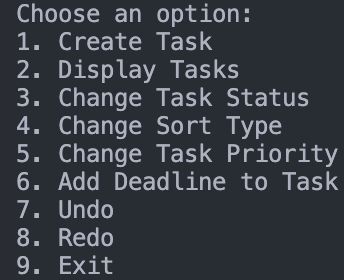

# Task Management System

This Dart project is a simple console-based task management application that demonstrates the use of design patterns such as the Memento pattern for undo/redo functionality and various other design principles.

## Features

- **Task Creation:** Add tasks to the task list.
- **Display Tasks:** View and display the list of tasks.
- **Change Task Status:** Update the status of tasks.
- **Change Sort Type:** Change the sorting strategy for displaying tasks.
- **Undo/Redo Functionality:** Use undo and redo to navigate through task history.
- **Add Deadline to Task:** Assign a deadline to a task for time-sensitive operations.
- **Change Task Priority:** Adjust the priority level of tasks.

## Design Patterns Used

- **Memento Pattern:** Captures and externalizes the state of a task for undo and redo functionality.
- **Strategy Pattern:** Used for sorting tasks based on different strategies.
- **Observer Pattern:** Allows the observation of changes in tasks, such as saving to a text file.
- **Decorator Pattern:** Used to dynamically add additional features to tasks, such as adding a deadline.
- **Factory Pattern:** Employed for creating instances of tasks and task-related objects.
- **State Pattern:** Allows tasks to transition between different states, such as `To Do`, `In Progress`, and `Done`.
- **Singleton Pattern:** Ensures a single instance of critical components, enhancing efficiency and consistency, such as `TaskManager`.


## Getting Started

1. Clone the repository:

    ```bash
    git clone https://github.com/yourusername/dart-task-management.git
    cd dart-task-management
    ```

2. Run the Dart application:

    ```bash
    dart main.dart
    ```

## Usage

Follow the on-screen instructions to interact with the task management application.

## Contributing

Contributions are welcome! Feel free to open issues or submit pull requests.

